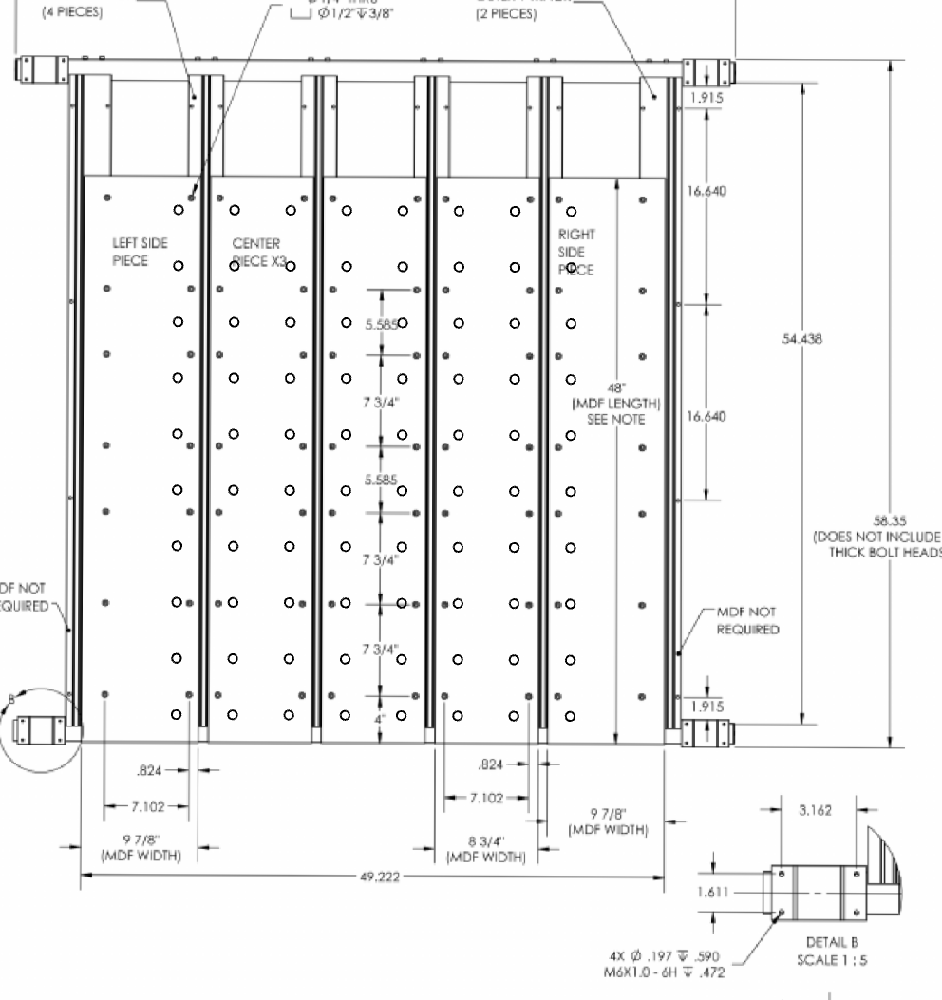

# Spoilboard Dog Holes
## A project for Onefinity Foreman QCW Frame

My first project hand-coded in Gcode. Cuts 3/4" dog holes, ten rows of eight holes each with a MASSO G3 Touch. 

### What it does

There is a main Gcode file and two subroutine files:
* `main.nc`: Sets up the program and cuts ten rows
* `1.nc`: Cuts a single row from the current relative position by calling `2.nc` for each hole to be printed
* `2.nc`: Cuts a hole

### What it looks like

### Why I published this?

Primarily to have as a whiteboard for feedback. This is my first Gcode. How can I improve it? 

It was kinda fun figuring this out. Obviously it would have been much easier to just do this with Fusion, but I wanted to learn the fundamental aspects of Gcode first. After doing so, I feel like I know a lot more about what a program like Fusion should expect, how to work with a touch probe and relative offsets, etc. 

One thing I'd like to figure out is how to get the same results with different bit widths. Maybe I need Gcode macros to make that sane. (Reminds me of old school assembly language programming...)

The experience of what it would be like to run a FANUC is also fascinating. 

There is so much to learn!

### Use

1. Read the code and make sure it does what you expect
2. Set up with a 1/4" endmill bit. I used [The Beast](https://idcwoodcraft.com/products/the-beast-1-4-roughing-endmill-bit-for-cnc-routers-1-4-shank) from IDC Woodcraft. Different bits may require different changes. 
2. Zero the tool at the center of the lower left hole
3. Go

### License
Apache 2.0
